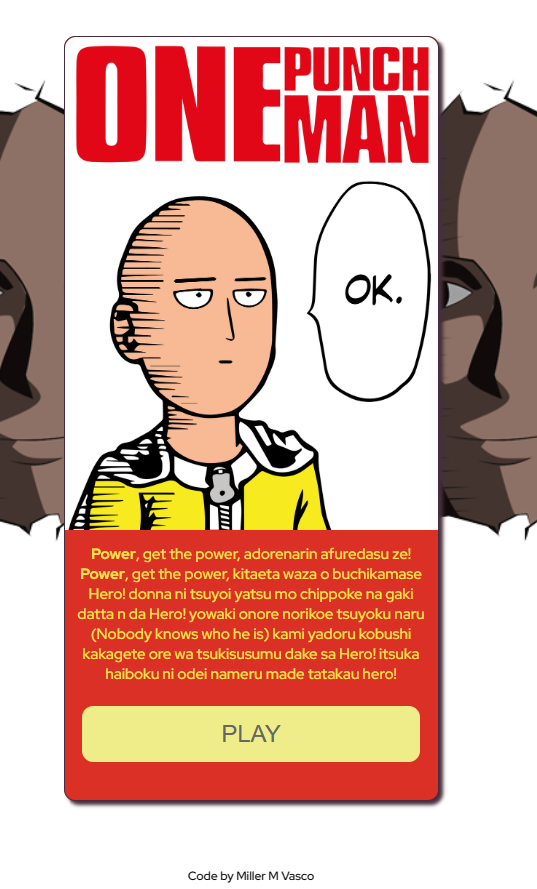

# Projeto One Punch Man - Card do Saitama

Este repositório contém um projeto relacionado ao anime "One Punch Man", onde é apresentado um card do personagem Saitama. O projeto consiste em exibir um texto breve da música tema do anime e um botão que direciona para um vídeo no YouTube.

## Preview do Projeto Concluído

Você pode conferir a versão final do projeto em funcionamento [aqui](link para a visualização online do projeto).

## Tecnologias Utilizadas

- HTML5
- CSS3
- JavaScript

## Funcionalidades e Implementações

- Exibe um card do personagem Saitama.
- Apresenta um breve texto da música tema do anime.
- Ao clicar no botão "PLAY", o usuário é direcionado para o vídeo relacionado no YouTube.

## Aprendizados e Desafios

Durante a criação deste projeto, pude praticar o uso de HTML, CSS e JavaScript para construir a estrutura do card, estilizar os elementos e adicionar interatividade. Aprendi técnicas de manipulação do DOM, como exibir e atualizar conteúdo dinamicamente, e utilizei CSS para criar o layout e os estilos adequados.

Um dos desafios enfrentados foi garantir que o card ficasse responsivo e funcionasse corretamente em diferentes tamanhos de tela. Também trabalhei para tornar o código organizado, legível e seguindo as melhores práticas de desenvolvimento web.

## Contribuição

Contribuições não são aceitas neste repositório, pois se trata de um projeto individual. No entanto, sinta-se à vontade para explorar o código, fazer fork do repositório e adaptá-lo de acordo com suas necessidades.